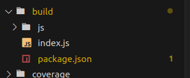

### Pocket.js (P/p)

#### [ Developed by Eaglex ](http://eaglex.net)

#### About

-   Easy to use, lightly sophisticated Pocket.js redistribution controller, allowing you to probe data with status management.
-   Well documented, clean beautified code.
-   You assign tasks associated to individual `Probes` controlled by `Pocket.js`, once your payload status is: `complete`, `await ready(id)` can be resolved.

#### Why use it

-   Project is status driven, requires tasks to complete
    -   many iterating, looping thru data
-   Specify `tasks`, and receive results by assignment
-   Manage each task ( Probe/task ) states and resolutions
-   Re/distribution of data/scheduled assignments to different areas of your code
-   Creative flexibility - _make your work easier and justifiable_, simply more fun
-   Easy to use, user friendly, chaining mythology

#### Stack

-   Node.js, ES6, JavaScript, data-management, state/management, Promise, prototyping, class chaining, Istanbul/nyc, Eslint, Mocha/Chai, Custom Utils, debug/error exception handling, user/friendly logging, jsdocs

#### About the code:

-   `PocketModule` manages each `new Probe()`, when status `=complete` is set, `sq.resolve()` and dispatch is initiated. Final results are returned in `await $ready(payloadID)`

-   Well documented with debug logging
-   Good catch exceptions
-   In depth `Mocha` tests with good nyc/Istanbul coverage.

#### What is Pocket

-   `Pocket > Probe`: Main/parent module managing each new payload and `Probe` until resolved, give tools access to user.

#### What is a Probe

-   `Probe < Pocket`: Child module doesnt know about Pocket, status/state managed so when `complete`, Pocket intercepts it, and waits until all Probe tasks `complete`. Can be used independently if needed.

#### Playground

[ pocket.js on codesandbox ](https://codesandbox.io/p/github/eag1ex/pocket.js/)

_ps: login to get the latest code_
<br/>

you can play around with `/samples`

```sh
## first install
npm i

## then play :)
node /samples/simple

## or
npm run example
```

### Pocket code documentation

Project docs are available on github pages at: [ Pocket.js ](https://eag1ex.github.io/pocket.js/)

## How to build

Building project for production: `common.js` and` Windows/browser` is available, take a look inside `package.json`.

1. To run build from source, run `npm run build:umd`, this will create universal production bundle available to use in browser and Node.js backend.

2. there is already an available build you can use, `require("./build")`, if importing as package `require("pocket/build")`
3. 

#### PocketModule config/opts and status logic:

-   `PocketModule.opts{}`: available options on constructor to be set with instance creation.

    -   `opts.onChange:boolean`: enables property watch on each Probe, and lets you use `$onChange` method
    -   `opts.completeOnNull:boolean`: when set will allow completion of any probe even it data is still in initial null phase
    -   `opts.withDataBank`: enables Probe{} .data to provide dataBank on every return for data history changes
    -   `opts.deleteWithDelay:number`: remove all project data with given delay after $ready has been resolved, defaults to `1000` ms
    -   `opts.async:Boolean`: when set will handle `await payload(asyncData)` as Promise.
    -   `opts.dispatcher:Boolean`: when set will load `Dispatcher module`, in to Pocket instance, and allow additional live on-change logging and direct communication with each Probe, currently this feature is limited to only logging, must set `debug:true` to see it in action. `[dispatcher]...`.
    -   `debug:Boolean`: will log additional messages on what is happening, good for debugging :)!

-   `Probe status logic`: each Probe has `status`, which gives it the required interaction behavior through out each payload. Status list, runs in forward motion, once the status is set to `complete` nothing can be changed:
    -   `open`: When new Probe is created, first status is created automatically, its status will remain the same until `Probe.data` property is updated, it can never be set back to `open`.
    -   `updated`: status is set automatically once first `Probe.data` is updated to any true value, it can be re updated, once initial `data` was previously set
    -   `complete`: when Probe/task is done, `Probe.sq.resolve()` is called, and nothing more can be done.
    -   `send`: automatically set after `Probe.sq.resolve()` is called, cannot be set manually, it is used to identify last status
    -   `error` works same as `complete`, with small difference... it is set last in `statusStackOrder`

#### PocketModule methods:

-   **$payload( data, async,type ).d:Boolean** : top level method to initiate requested tasks, returns true when successful, and false on error.

    -   `data.id:String`: payload.id that identifies this job
    -   `data.tasks:Array[]`: specifies required format/data of tasks to perform. Specifications for this can be found in `./samples/**`
    -   `async`: when passing data is a defer you need to specify data type output as async:true, or set it in global options on Pocket instance
    -   `type`: if our payload is in the loop, for example: we do not want to override existing values, we can set it to type='update' (default is `new`)

-   **$probeStatusAsync( probeID ).d:promise** : returns last status changed via async method, the promise is reset overtime new status is updated, so it can be called many times, returns status name

    -   `probeID`: must provide probeID example: `${payloadID}::${task}`

-   **Probe.getStatusAsync** : same as ^^above^^, method can be called on each Probe/task instance, good for checking latest status in question, where its needed :)

-   **$get( probeID ):Probe**: returns an active instance of your Probe/task => `$get(probeID).status='complete'`, you can also use it instead of `$update()`

    -   `probeID:String`: provided format must be, example: `${payloadID}::${task}`

-   **$update( dataFrom, mergeData,probeID).d:Boolean** : will select currently available Probe/task by `id`, and update its data, only available fields found on Probe can be updated according to setter/getter requirements

    -   `probeID:String`: required probeID, each probe `probeID` makes up: `${payload.id}::${task}`, dynamically created upon `$payload(..)===true`
    -   `dataFrom:{}`: available fields example: `dataFrom:{data:'some cola', campaign:'cocacola',status:'complete'}`, will perform an update on Probe[id][data], Probe[id][campaign], etc. Validation is sensitive.
    -   `mergeData`: when specified and `dataFrom.data` field is set, will merge both

-   **$activeTasks( payloadID ).d:Array**: returns an `array['taskA','taskB']` from current job payload, will only be available before `$ready(..)` is resolved, and before PocketSet tasks are completed.

-   **$ready(payloadID, allowMultiple).d:Promise**: last calling method, when your `Pocket` tasks are completed, example: `Probe[id][status]='complete'` only then, will it resolve(), otherwise pending Probe's will remain and `$ready()` will expire, this is the desired effect, most logical behavior.

    -   `allowMultiple:boolean = false`: if you want to allow calling same project $ready(..) multiple times then set `allowMultiple=true`, otherwise it will give you warning. By default is set to `false`.

-   _Final note: All user/interaction methods are prefixed with '$'_
-   _Note: Most user $methods require `...).d` for access to values, to allows chaining_

#### PocketModule selectors:

-   `Probe{} selectors list:`
-   **$removeProject(projectID)**: removes the project in case not already removed
-   **$projectSet(projectID)**: tells if project already created
-   **$of(probeID = ''):self**: selects pointer to Probe{}
-   **$probeStatusAsync(probeID).d:Promise**: resolves promise when status changes
-   **$project(data)/$payload(data,async, type = 'new')**: alias of $payload
-   **$getByRef(probeRef):[Array]**: returns an array of probes that match the Probe.ref
-   **$probe(probeID):Probe{}**: returns Probe{} by id
-   **$select(projectID):self**: sets pointer to the project
-   **$filter(cb, projectID):self**: filters probes that match condition true, in a callback
-   **$compute(cb, projectID = ''):self**: loops thru each probe (if previously filtered/or all) that can be manipulated
-   **$projectID**: getter/ return last projectID
-   **$list(projectID = '', cb = null, type = 'self'):Array[]**: list active Probes{} by project id, should return all assigned probe/tasks regardless of status
-   **$transfer(fromProbeID = ''):self**: select data from `fromProbeID` and hold it in `_transferCache`, until `$to(probeID)` is called
-   **$to(toProbeID = '', pointToThisProbe = true, maxDelay = 100):self**: works together with `$transfer`, will transfer `data` from one Probe{} to another
-   **$data(dataProp:{}||[] , probeID = '', self = false)**: returns Object copy of `Probe['data']`
-   **$cached(dataProp = {}, probeID = ''):{}**:
-   **$campaign(probeID):string**:
-   **$ref(probeID)**:
-   **$status(probeID):String**:
-   **$task(probeID):string**:
-   **$error(probeID):[]**:
-   **$all(probeID):probeGetters**:
-   **$architect(cb, projectID)**: more construct way of setting up a project and allowing few external assets to be used. This method uses $payload inheritance with access to `type` and `async`. Things to remember consecutive call to $architect thru  .$condition() method, can only update existing items.
    -   `cb(()=>({project:payloadData, type,async}))`: return callback must return {project:payload} as minimum requirement, when running in a loop or repetitive actions, it is best to set type='update' so that concurrent call to the same task wont wont be ignored, `type` is state base, so last setting is kept
-   **$asset(assetName, projectID)**: can access the asset declared in `$architect`
-   **$condition(cb,id)**: declare arguments within callback without exiting Pocket block chain. The `id` you pass: probe `::id` or `projectID`, will expose access to self of either Probe or Pocket instance. The return of callback is sensitive, if no value is passed the Pocket/self is returned. For example if accessing Probe then probe id can be returned but the chaining will refer to its instance, you may want to return pocket self instead.
-   **$exists(probeID):boolean**: check if probe exists, specify `probeID`, returns boolean.
-   **$onChange(cb, watchProp, ProbeID):self**: when `opts.onChange:boolean` is set, watches changes of Probe
    -   `watchProp:String`: provide property name to watch, defaults to `all`
-   **$onProbeComplete(cb, probeID):self**: listen to callback on one, or all probes that completed due process
    -   `cb((allData,id))`
    -   `probeID` : optionally select if wishing on only listen for one probe by id

#### Code/extensions

for comments/and linting use:

-   `Document This`
-   `Add jsdoc comments`

#### TODO on premium release:

-   **(add)** typescript support in later version.
-   **(add)** browser version support.
-   **(add)** history state management.

#### Test / Mocha and coverage

-   To run a Mocha test: `npm run mocha`
-   To run full coverage test with Instanbul: `npm run test`
-   Coverage can be found in `./coverage/index.html`

#### Examples

```js
// ./samples/simple.js

// can use production/bundle after running: /$ npm run build:umd
// const Pocket = require("../build/index")

const Pocket = require("../index").Pocket
const pock = new Pocket({ async: false, dispatcher: true, withDataBank: true, onChange: true, deleteWithDelay: 0, completeOnNull: true }, true)

const data1 = {
    // source: `https://en.wikipedia.org/wiki/List_of_projects_of_the_Belt_and_Road_Initiative`
    id: "pocket-1", // Belt and Road Initiative
    tasks: [
        {
            ref: "abc",
            task: "china",
            data: { assets: 10, type: "billions", info: "benefactor" },
            campaign: "Belt_and_Road_Initiative"
        },
        {
            task: "srilanka",
            ref: "efg",
            data: { budget: 1.4, type: "billions", project: "naval port" },
            campaign: "Belt_and_Road_Initiative"
        }
    ]
}

const data2 = {
    // source: `https://en.wikipedia.org/wiki/List_of_projects_of_the_Belt_and_Road_Initiative`
    id: "pocket-2", // Belt and Road Initiative
    tasks: [
        {
            ref: "abc",
            task: "china2",
            data: { assets: 10, type: "billions", info: "benefactor" },
            campaign: "Belt_and_Road_Initiative"
        },
        {
            task: "srilanka2",
            ref: "efg",
            data: { budget: 1.4, type: "billions", project: "naval port" },
            campaign: "Belt_and_Road_Initiative"
        }
    ]
}

const onSet1 = pock.$project(data1, false, "update").d
const onSet2 = pock.$project(data2, false, "update").d

if (onSet1 && onSet2) {
    pock
        .$compute(function (probe, id) {
            // do something
            // this.error = 'error!'
        })
        .$filter(function (probe) {
            // filter by probe data attributes
            return true
        }).d // access computed data , or continue chaining

    pock.$select(`pocket-1`)
        .$filter((probe) => {
            return probe.task === "china"
        })
        .$compute(function (probe, id) {
            // run thru all probe tasks based on filter condition
            console.log("pocket-1/probe.task", probe.task)
            this.data = "new data"
            this.status = "complete"
        })
        .$select(`pocket-2`)
        .$filter((probe) => {
            return true
        })
        .$compute(function (probe, id) {
            // run thru all probe tasks based on filter condition
            console.log("pocket-2/probe.task", probe.task)
            this.data = "new data2"
            this.status = "complete"
        })

    //.$update({ data: { assets: 10.55 } }) << higher priority over
}

// observe all changes of china pocket
pock.$get(`pocket-1::china`).onChange(function (data, id) {
    console.log("pocket-1::china onChange", data.status, id)
}, "all")

// observe all pocket changes
pock.$get(`pocket-1`).onChange(function (data, id) {
    console.log("pocket-1 onChange", data.status.id)
}, "all")

// catch results when all of pocket-1 probe tasks have completed
// pocket-1 did not complete because we have set .$filter oen one task only
pock.$ready(`pocket-1`, true)
    .d.then((z) => {
        console.log("pocket-1 ready", z)
    })
    .catch((err) => {
        console.log("ups", err)
    })

// catch results when all of pocket-2 probe tasks have completed
// this pocket has completed all tasks
pock.$ready(`pocket-2`, true)
    .d.then((z) => {
        console.log("pocket-2 ready", z)
    })
    .catch((err) => {
        console.log("ups", err)
    })

// accessors
// console.log("[pock.$get][data]", pock.$get("pocket-1::china").data)
// console.log("[pock.$get][dataBank]", "pocket-1::china", pock.$get("pocket-1::china").dataBank)
```

##### Contact

-   Have questions, or would like to submit feedback, `contact me at: https://eaglex.net/app/contact?product=Pocket.js`

##### LICENSE

-   LICENSE: CC BY-NC-ND
-   SOURCE: https://creativecommons.org/licenses/by-nc-nd/4.0/legalcode
